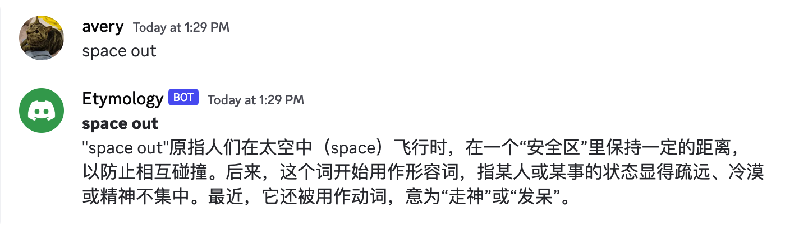
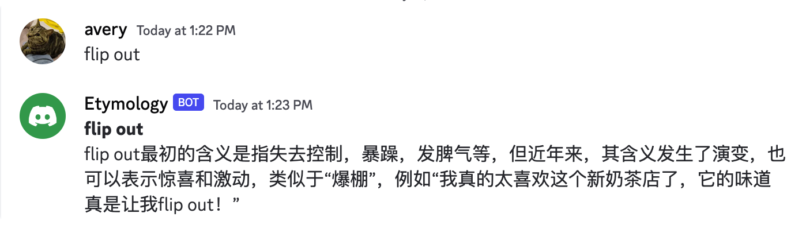
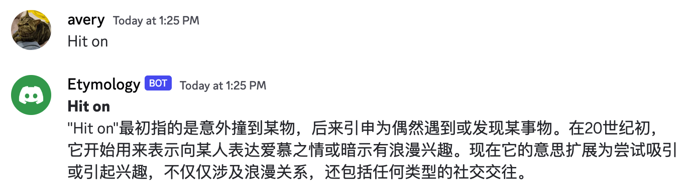
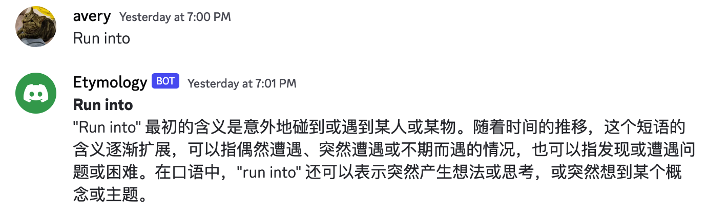

# Etymology Bot | 词源机器人

知其所以然，发现语言的魅力。

这是一个基于 ChatGPT 的帮助你了解英文词汇演变史的 Discord 机器人。

This is a Discord bot based on ChatGPT that helps you understand the evolution of English phrase. Knowing the reason behind it, you can discover the charm of language.

## 示例 | Examples

<div style="display: grid; grid-template-columns: auto auto; gap: 10px;">
  
  
  
  
</div>

<center style="text-align: center;">
  <small>
    <b>
      喜欢请 Star ⭐️ 一下，非常感谢
      <br />
      It's really appreciate your Star ⭐️
    </br>
  </small>
</center>

## 如何使用 | How to use

1. Fork this repository to your own account
2. Clone code and switch path to project folder in terminal
3. Run command below for dependencies installation

```bash
pip3 install -r requirements.txt
```

4. Edit `etymology.py`, and replace variables called `discord_token` and `openai.api_key` with your own token
   > FAQ
   >
   > Q: Don't have discord bot token?
   >
   > A: Please follow steps in this [article](https://appmaster.io/zh/blog/discord-bot-ru-he-chuang-jian-ta-bing-jiang-qi-tian-jia-dao-fu-wu-qi) to create a discord bot and connect to your discord server.
   >
   > Q: Don't have openai api key?
   >
   > A: Go for it at [here](https://platform.openai.com/account/api-keys)
5. All the above steps are ready, let's start up the bot service, run command below in terminal

```bash
python3 etymology.py
```

6. Send any phrases in discord channel, and wait for seconds, this bot will reply its etymology
